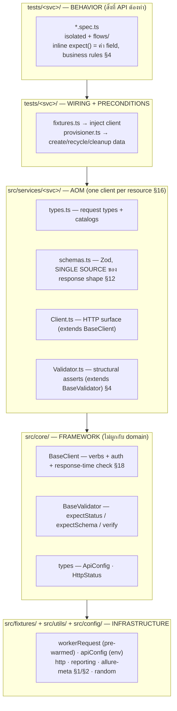
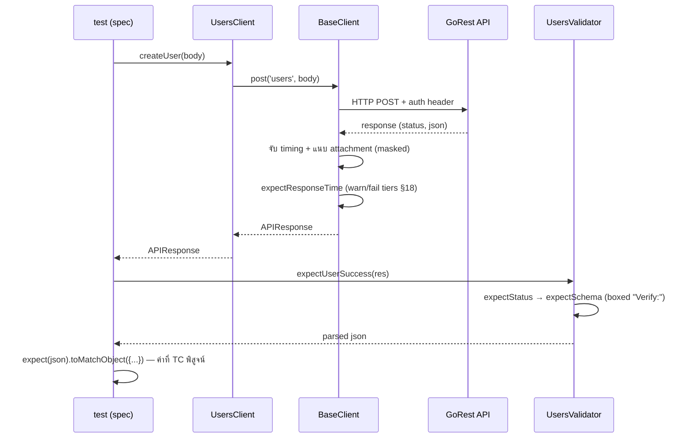

# Architecture — layer ต่างๆ และเหตุผลที่มีอยู่

หน้าเดียว เน้น design รายละเอียดโค้ดอยู่ในไฟล์ที่ link ไว้; เหตุผลการตัดสินใจอยู่ใน
[decisions.md](decisions.md) (ตัวเลข § อ้างอิงถึงเอกสารนั้น)
ยังไม่รู้ว่า test / fixture / AOM คืออะไร? เริ่มที่ [concepts.md](concepts.md) ก่อน

## 4 Layers

## ทำไมแต่ละ layer ถึงมีอยู่

- **core vs services** — `core` รู้เรื่อง HTTP และ assertions แต่ไม่รู้จัก domain เลย การเพิ่ม service ใหม่ใช้แค่สี่ไฟล์และไม่ต้องแก้ core; การแก้ core (เช่น response-time policy, §18) จะกระทบทุกที่พร้อมกัน
- **one client per service, ไม่ใช่ per story (§16)** — REST เป็น resource-oriented; user story ทับซ้อนกันข้าม service แต่ resource ไม่ทับ story อาศัยอยู่ที่ test layer ซึ่งประกอบ client หลายตัวเข้าด้วยกัน
- **schema เป็น single source (§12)** — Zod schema ทำหน้าที่ทั้ง validate response และ generate response types (`z.infer`) ทำให้ shape กับ type ไม่มีทางแยกออกจากกัน `looseObject` ทำให้ field แปลกๆ ที่ไม่ได้ประกาศยังมองเห็นได้ใน assertions
- **two-layer assertions (§4, §5)** — validator assert structure (status, schema) เหมือนกันทุก test; test assert ค่าที่ทำให้ TC นั้นมีความหมาย ทั้งสอง layer ปรากฏใน report: boxed `Verify:` node จาก validator, inline diff (`toMatchObject`) จาก behavior
- **fixtures ควบคุม scope (fixtures.md)** — request context เป็น worker-scoped (TCP pool อุ่นพร้อมต่อ worker หนึ่งชุด); config และ clients เป็น test-scoped (แต่ละ test ได้ `testInfo` ของตัวเองเพื่อให้ทุก request แนบไปถูก report) provisioner เป็น worker-scoped เพราะ cache และ cleanup ครอบคลุมหลาย test
- **provision, don't seed (fixtures.md, §6, §8, §17)** — ทุก mutable precondition สร้างตอน runtime ใต้ prefix `autotest-`, นำกลับมาใช้ได้เมื่อเป็น read-only, และลบทิ้งใน teardown มีเพียง credentials และ deterministic reference data (constants, §17) เท่านั้นที่อยู่นอก tests

## Trace ของ request หนึ่งครั้ง

อ่านในโค้ดได้ที่: [tests/users/create.spec.ts](../tests/users/create.spec.ts) TC-005
