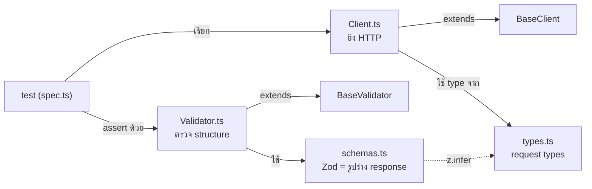

# Concepts — test / fixture / AOM คืออะไร

ไฟล์นี้อธิบายศัพท์พื้นฐานก่อนไปอ่าน design rationale ใน [LEARNING-PATH.md](../LEARNING-PATH.md)
ถ้ารู้จัก Playwright + AOM อยู่แล้ว ข้ามไปได้เลย

---

## Test คืออะไร

Test หนึ่งตัว = ฟังก์ชันที่ (1) ยิง request ไปหา API แล้ว (2) assert ว่าผลลัพธ์ตรงกับที่คาดไว้
ถ้า assert ไม่ผ่าน → test fail (RED); ถ้าผ่านหมด → test pass (GREEN)

```typescript
test('should create a user', async ({ usersClient }) => {
  const res = await usersClient.createUser({ name: 'autotest-x', ... }) // 1. ยิง
  await UsersValidator.expectUserSuccess(res, HttpStatus.CREATED)        // 2. assert structure
  expect(await res.json()).toMatchObject({ name: 'autotest-x' })         // 2. assert ค่า
})
```

`{ usersClient }` ที่อยู่ใน argument คือ **fixture** (อ่านต่อด้านล่าง) — Playwright เป็นคนเตรียมให้

ประเภทของ test ในโปรเจคนี้:

- **isolated** (`@isolated`) — test endpoint เดียว เช่น "POST /users ต้องคืน 201"
- **flow** (`@flow`) — หลาย step ต่อกัน เช่น "create → get → update → delete"

---

## Fixture คืออะไร

Fixture = กลไก **dependency injection** ของ Playwright — แทนที่แต่ละ test จะ setup ของเองซ้ำๆ
(สร้าง HTTP client, โหลด config, login) fixture เตรียมไว้ให้แล้ว test แค่ขอมาใช้

```typescript
// test แค่ "ขอ" usersClient — ไม่ต้องสร้างเอง
async ({ usersClient }) => { ... }
```

จุดสำคัญของ fixture คือ **scope** — ของชิ้นนี้มีอายุยาวแค่ไหน:

| Scope      | สร้างเมื่อไหร่               | ตัวอย่างในโปรเจค                               |
| ---------- | ---------------------------- | ---------------------------------------------- |
| **test**   | ใหม่ทุก test                 | `usersClient`, `apiConfig`                     |
| **worker** | ครั้งเดียวต่อ worker process | `workerRequest` (TCP pool), `usersProvisioner` |

ทำไมต้องแยก scope? — TCP connection แพง เปิดครั้งเดียวต่อ worker (worker-scoped) แล้ว reuse;
แต่ client ต้อง test-scoped เพราะแต่ละ test ถือ `testInfo` ของตัวเองเพื่อให้ report แนบถูกที่
รายละเอียด: [.claude/rules/fixtures.md](../.claude/rules/fixtures.md)

Fixture ยังทำ **setup/teardown** ได้ — โค้ดก่อน `await use(x)` คือ setup, หลังจากนั้นคือ teardown:

```typescript
usersProvisioner: [async ({ workerRequest }, use) => {
  const p = new UsersProvisioner(...)   // setup
  await use(p)                          // ← test รันช่วงนี้
  await p.cleanup()                     // teardown: ลบ user ที่สร้างทั้งหมด
}, { scope: 'worker' }]
```

---

## AOM (API Object Model) คืออะไร

AOM = pattern ที่ห่อการเรียก API ของแต่ละ resource ไว้ใน class เดียว แทนที่จะให้ test
ยิง HTTP ดิบๆ เอง (ถ้าใครเคยใช้ **Page Object Model** ใน UI testing — AOM คือแนวคิดเดียวกัน
แค่เปลี่ยนจาก "หน้าเว็บ" เป็น "API resource")

**ถ้าไม่มี AOM** — ทุก test ต้องรู้ path, method, header, การ parse เอง พอ API เปลี่ยนต้องแก้ทุก test:

```typescript
// ❌ กระจัดกระจาย ทุก test ต้องรู้รายละเอียด HTTP
const res = await request.post('https://gorest.co.in/public/v2/users', {
  headers: { Authorization: `Bearer ${token}` }, data: {...}
})
```

**มี AOM** — รายละเอียดอยู่ที่เดียว test อ่านเหมือนภาษาคน:

```typescript
// ✅ test สนใจแค่ "ทำอะไร" ไม่ใช่ "ยิงยังไง"
const res = await usersClient.createUser({...})
```

### ชิ้นส่วนของ AOM (หนึ่ง resource = 4 ไฟล์ ใน `src/services/users/`)



| ไฟล์           | หน้าที่                                                            |
| -------------- | ------------------------------------------------------------------ |
| `Client.ts`    | method ต่อ endpoint (`createUser`, `getUser`) — ยิง HTTP           |
| `Validator.ts` | assert **structure** — HTTP status ถูกไหม, response ตรง schema ไหม |
| `schemas.ts`   | Zod schema = นิยามรูปร่าง response **แหล่งเดียว** ของ type         |
| `types.ts`     | request body types + ค่าคงที่ (enum, error messages)               |

`Client` กับ `Validator` สืบทอดจาก `BaseClient`/`BaseValidator` ใน `src/core/` ที่ไม่ผูกกับ
domain — เพิ่ม resource ใหม่จึงไม่ต้องแตะ core (ดู [architecture.md](architecture.md))

---

## คำอื่นที่เจอบ่อย

- **Provisioner** — ตัวสร้าง test data ตอน runtime (สร้าง user จริงผ่าน API) แล้วลบทิ้งใน teardown
  ไม่ seed ข้อมูลตายตัว → test เป็นอิสระจากกัน รันกี่รอบก็เหมือนเดิม
- **Schema (Zod)** — นิยามว่า response หน้าตาเป็นยังไง ใช้ทั้ง validate ตอน runtime และ
  generate TypeScript type (`z.infer`) จากนิยามเดียวกัน → type กับของจริงไม่มีทาง drift
- **`autotestSlug()`** — สร้างชื่อสุ่มที่ขึ้นต้นด้วย `autotest-` เพื่อให้ cleanup หา record ที่เราสร้างเจอ
- **Two-layer assertion** — validator ดู structure (เหมือนกันทุก test), inline `expect` ดูค่า (ต่างกันต่อ test)

---

## อ่านต่อ

- **ทำไมถึงออกแบบแบบนี้** → [LEARNING-PATH.md](../LEARNING-PATH.md) (10 บทเรียน)
- **layer map + request flow** → [architecture.md](architecture.md)
- **กฎการเขียน test/fixture จริง** → [.claude/rules/](../.claude/rules/)
