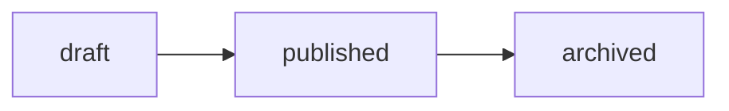

# products — 03 Flow (state machine)

The only stateful behavior in the feature is the product status machine (REQ-008,
deferred to the exercise). Transition table is the primary artifact; each row maps 1:1
to a future TC.

## Transition table

| From      | Trigger                  | To        | Expected                                | TC link    |
| --------- | ------------------------ | --------- | --------------------------------------- | ---------- |
| draft     | PATCH status=published   | published | 200 OK, status persisted                | (exercise) |
| published | PATCH status=archived    | archived  | 200 OK, terminal                        | (exercise) |
| draft     | PATCH status=archived    | —         | 422 INVALID_TRANSITION                  | (exercise) |
| published | PATCH status=draft       | —         | 422 INVALID_TRANSITION                  | (exercise) |
| archived  | PATCH status=(any)       | —         | 422 INVALID_TRANSITION (terminal state) | (exercise) |
| (any)     | PATCH status=bogus value | —         | 400 INVALID_DATA                        | (exercise) |

## Happy path (minimal diagram)

Invalid transitions live in the table only — keeping the diagram to the linear happy
path is deliberate (diagrams with self-loops/negatives tangle; the table is the source).
