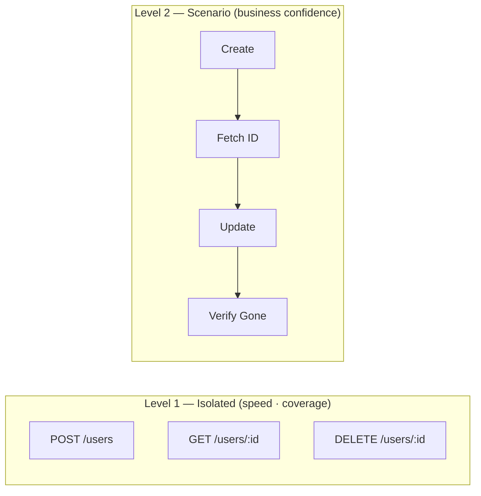

# API Test Case Strategy Guide

A framework-agnostic strategy for structuring, scoping, and reviewing API automation test cases.
Aligned with ISTQB test design techniques and Playwright AOM conventions.

---

## 1. Two Levels of API Testing

All API test cases fall into one of two levels. Both are necessary; neither replaces the other.



### Level 1 — Isolated (Endpoint) Testing

**Goal:** Verify that each endpoint behaves according to its contract in isolation.

- Does a complete request return 2xx with the expected schema?
- Does an invalid request return the expected error code and status?
- Does the response time stay within the SLA?

One file per endpoint. Fast to run, easy to debug, easy to maintain.

### Level 2 — Scenario (Integration Flow) Testing

**Goal:** Verify that a chain of endpoints produces the correct end-to-end outcome.

- Create → Fetch → Update → Delete
- Authenticate → Use protected resource → Revoke access

One file per user journey. Slower, but catches contract mismatches between endpoints.

> **Recommended order:** Cover all endpoints with Isolated tests first. Then identify the 3–5
> most critical happy paths and promote them to Scenario flows. Do not skip Level 1 in favour
> of writing only E2E flows — isolated tests find bugs faster and with less noise.

---

## 2. Isolated Tests Can Have Prerequisites

A common misconception: "isolated means no other API calls are allowed."

In practice, an isolated test **may call other endpoints to set up data** — the key is _where
the assertion lives_, not how many endpoints were called.

| Dimension           | Isolated (Endpoint)                                   | Scenario (Flow)                                |
| :------------------ | :---------------------------------------------------- | :--------------------------------------------- |
| **Data setup**      | Call other endpoints in `beforeEach`                  | Call endpoints sequentially inside `test body` |
| **What you assert** | Only the endpoint under test                          | Every endpoint in the chain                    |
| **If setup breaks** | Test is **skipped** (setup failure, not test failure) | Test **fails** (the flow itself is broken)     |

**Example — testing `DELETE /users/:id`:**

- **Isolated:** Call `POST /users` in `beforeEach` to get an ID → assert only the DELETE response
- **Scenario:** Assert POST → assert GET → assert DELETE → assert the record is gone

The isolated test focuses on _"does delete work?"_; the scenario test focuses on _"does the
full lifecycle work?"_

---

## 3. When to Write an Isolated Test

Ask these three questions before writing an isolated test:

1. **What can I assert if this endpoint runs alone?**
   If the answer is clear (status, schema, specific field values) → write isolated.
   If the answer is "nothing meaningful without prior state" → put it in a flow.

2. **How hard is the setup?**
   If setup requires a complex account state that is difficult to recreate (e.g., a flag set
   by an admin process, a time-limited OTP already consumed) → the test belongs in a flow.

3. **Is there a bypass available?**
   If the endpoint depends on an external process (TOTP, email link, third-party webhook)
   with no test bypass → use `test.skip` with an explanation until a bypass exists.

### Worked Example — Multi-Step Authentication Flow

Consider a login flow with these steps:

```
getDomainConfig → getCaptcha → validateCaptcha →
loginWithCredentials → request2FA → verify2FA → getAccessToken
```

| Endpoint               | Write Isolated? | Rationale                                                                     |
| :--------------------- | :-------------: | :---------------------------------------------------------------------------- |
| `getDomainConfig`      |       ✅        | No setup needed; assert response fields immediately                           |
| `getCaptcha`           |       ✅        | `beforeEach`: call `getDomainConfig`. Assert captchaImage is base64 PNG       |
| `loginWithCredentials` |       ✅        | Captcha bypass available via env var — fully isolatable                       |
| `validateCaptcha`      |       ❌        | Requires a live captchaId + correct text; scenario test already covers this   |
| `request2FA`           |       ❌        | Requires auth token from login — meaningful only as part of the chain         |
| `verify2FA`            |       ❌        | Requires live TOTP — no bypass; can only test sad path (wrong code) as a flow |
| `getAccessToken`       |       ❌        | Final step of 2FA chain — cannot be isolated meaningfully                     |

> **Pattern:** The first few endpoints in a chain are usually isolatable; the later ones
> that depend on short-lived tokens or external processes belong in flows.

---

## 4. Error Cases for Non-Isolated Endpoints

An endpoint without an isolated happy-path test may still have isolatable negative cases.
Decide based on _what causes the error_:

| Error cause                                              | Where to test                                              |
| :------------------------------------------------------- | :--------------------------------------------------------- |
| A bad **input field** sent directly in the request       | Negative isolated test (with `beforeEach` setup if needed) |
| **State from a prior step** is wrong                     | Sad-path flow test                                         |
| Requires an **external process** or timing (TOTP, email) | `test.skip` with explanation                               |

### Examples

**Negative isolated — wrong value in a direct input field:**

```typescript
// The captcha text is sent directly in the request body — isolatable
test.describe('POST /auth/captcha/validate — negative', () => {
  test.beforeEach(async ({ authClient }) => {
    await authClient.getCaptcha() // sets up captchaId
  })

  // Happy path is covered in the login flow — only negative cases here
  test('wrong captcha text returns error CAPTCHA_INVALID', async ({ authClient }) => {
    const res = await authClient.validateCaptcha({
      captchaId: process.env.CAPTCHA_BYPASS_ID,
      captchaText: 'ZZZZ',
      username: process.env.ADMIN_USERNAME,
    })
    await AuthValidator.expectError(res, { httpStatus: 400, code: 'CAPTCHA_INVALID' })
  })
})
```

**Sad-path flow — error caused by chained state:**

```typescript
// Wrong 2FA code — requires reaching that step first
test('invalid 2FA code returns error 2FA_CODE_INVALID', async ({ authClient }) => {
  // Build the chain up to the point under test
  await authClient.validateCaptcha({ ... })
  await authClient.loginWithCredentials({ ... })
  await authClient.request2FA()

  // Trigger the error here
  const res = await authClient.verify2FA({ code: '000000' })
  await AuthValidator.expectError(res, { httpStatus: 400, code: '2FA_CODE_INVALID' })
})
```

---

## 5. Validation Errors vs Business Errors

These look similar in a response body but have very different testing value.

| Type                 | Example                                       | Cause                                                        |
| :------------------- | :-------------------------------------------- | :----------------------------------------------------------- |
| **Validation error** | Missing required field, wrong type            | Request structure is malformed                               |
| **Business error**   | Wrong password, expired token, locked account | Request is structurally valid, but business rule rejected it |

**Business errors → always test.** Each one maps to a distinct system behaviour.

**Validation errors → ask one question first:**

> _"Do all invalid-input cases return the same error code?"_

- **Yes — same code for all:** Write one representative case, add a comment, stop.
- **No — different code per field:** Write one case per field; each reveals a distinct contract.

### Decision Examples

**Case A — backend returns the same code for every validation failure (common in internal APIs):**

```
missing `username`   → code "40001" "invalid parameter"
empty `password`     → code "40001" "invalid parameter"
wrong `captchaId` type → code "40001" "invalid parameter"
```

Write one test only:

```typescript
// Representative validation case — all missing/malformed fields return code "40001"
test('missing required field → 40001', async ({ client }) => {
  const res = await client.login({ captchaId, username, password: '' })
  await Validator.expectError(res, { httpStatus: 400, code: '40001' })
})
```

**Case B — backend returns a distinct code per field:**

```
missing `username`  → code "10001" "username is required"
missing `password`  → code "10002" "password is required"
invalid `captchaId` → code "10003" "captcha not found"
```

Write one test per field — each reveals a separate contract.

**Extra fields (sending unexpected properties):** Most APIs silently ignore them. No meaningful
assertion is possible → skip entirely.

### Summary Decision Table

| Case                                                             |       Test it?        | Location                           |
| :--------------------------------------------------------------- | :-------------------: | :--------------------------------- |
| Business error (wrong credential, expired token, locked account) |       ✅ always       | Negative isolated or sad-path flow |
| Validation error — each field returns a different code           |   ✅ one per field    | Negative isolated                  |
| Validation error — all fields return the same code               | ✅ one representative | Negative isolated                  |
| Extra / unknown fields in the request body                       |        ❌ skip        | —                                  |

---

## 6. Test Case Documentation

Choose the format that fits your team's tooling:

**Option A — Test Management Tool (Jira/Xray, Zephyr, TestRail):**
Document pre-conditions, request body, expected status, and expected response
in the tool before writing code. Use the ticket ID as the test name prefix.

**Option B — Spec as Documentation (code-first):**
The `.spec.ts` file _is_ the test case document. Name each `test()` so it reads
like a test case: `'should return 404 when user does not exist'`.
Best for teams where engineers write the tests — eliminates double documentation.

**Minimum fields for any test case format:**

| Field                 | Content                                       |
| :-------------------- | :-------------------------------------------- |
| Scenario              | One sentence: what is being tested and why    |
| Pre-condition         | Any required state before the request is sent |
| Method + Endpoint     | e.g. `POST /users`                            |
| Request body / params | Exact input (or template with placeholders)   |
| Expected HTTP status  | e.g. `201 Created`                            |
| Expected response     | Schema + key field values                     |

---

## 7. Automation vs Manual Testing

| Dimension              | Manual                                          | Automation                                                    |
| :--------------------- | :---------------------------------------------- | :------------------------------------------------------------ |
| **Test data**          | Reuses existing records; shared between testers | Fresh data created per run (`autotest-*` prefix for cleanup)  |
| **Assertions**         | Visual inspection — loose                       | Precise: schema, HTTP status, response time SLA, field values |
| **Cleanup**            | Data stays in the system                        | Global teardown deletes `autotest-*` resources automatically  |
| **Speed**              | ~1 case / minute                                | ~100 cases / 5 seconds                                        |
| **Edge case coverage** | Main happy paths only                           | Hundreds of negative and boundary cases                       |

Automation does not replace exploratory or usability testing. It replaces the _repetitive,
mechanical_ assertions that slow down every release cycle.

---

## 8. Feature Breakdown Process

Use these six steps for every feature, regardless of size.

---

### Step 1 — Read Requirements Before Writing Any Case

Do not write a single test until you have read the requirement, wireframe, or user story end-to-end.

Questions to answer before starting:

- What are the failure modes? (lock after N attempts? session expiry?)
- What error messages does the API return?
- Are there fallbacks if a step fails?
- What account roles or states affect behaviour?

> Skipping this step guarantees gaps in coverage.

---

### Step 2 — Identify Sub-Features

A feature delivered as one ticket often contains several independently testable sub-features.
List them all before writing any case. If you cannot list them, you do not yet understand
the requirement (return to Step 1).

**Example — "User Registration" feature may contain:**

- `POST /users` endpoint contract
- Email uniqueness validation
- Password strength enforcement
- Welcome email trigger (if verifiable via API)
- Account status transitions (PENDING → ACTIVE → SUSPENDED)

---

### Step 3 — Draw the State Diagram

Before writing state-transition test cases, draw the state machine:

```
                    ┌─────────────┐
         ┌──────────│   PENDING   │──────────┐
         │          └─────────────┘          │
      verify                             expire
         │                                   │
         ▼                                   ▼
  ┌────────────┐   suspend    ┌──────────────────┐
  │   ACTIVE   │────────────→ │   SUSPENDED      │
  └────────────┘              └──────────────────┘
        │                             │
     delete                       reactivate
        │                             │
        ▼                             ▼
  ┌──────────┐                 ┌────────────┐
  │ DELETED  │                 │   ACTIVE   │
  │(terminal)│                 └────────────┘
  └──────────┘
```

Transitions that appear in the diagram immediately become test cases:

- Valid transitions (PENDING → ACTIVE) → positive
- Invalid transitions (DELETED → ACTIVE) → negative (expect 4xx)
- Terminal states (DELETED) → verify no further transitions are accepted

---

### Step 4 — Select Techniques Per Sub-Feature

| Sub-feature characteristic                     | Recommended technique                                         |
| :--------------------------------------------- | :------------------------------------------------------------ |
| Input fields (text, number, date)              | Equivalence Partitioning (EP) + Boundary Value Analysis (BVA) |
| Complex business rules (multi-condition logic) | Decision Table                                                |
| States that change over time                   | State Transition Testing                                      |
| Multi-step user journey                        | Use Case / Scenario Testing                                   |

Apply EP/BVA mechanically to every input field:

- **Valid partition:** representative value that should succeed
- **Invalid partition:** representative value that should fail (one per distinct error code)
- **Boundary:** values at and just outside the defined limits (max length ± 1, date edge)

---

### Step 5 — Organise into Test Suites

Group cases by suite before writing code. Suggested structure:

| Suite                   | Contents                                                  |
| :---------------------- | :-------------------------------------------------------- |
| **Functional**          | Happy path per endpoint — validates the contract          |
| **Validation**          | Missing/invalid/malformed inputs — validates error codes  |
| **State Transition**    | Valid and invalid state changes                           |
| **Business Flow (E2E)** | Multi-endpoint scenarios — validates end-to-end behaviour |

Within each suite, order cases:

```
Happy Path → Alternative Paths → Negative Cases → Edge Cases
```

---

### Step 6 — Coverage Checklist Before Sign-off

Before handing the test plan for review, check every item:

- [ ] Every actor / role that can call the API has at least one test
- [ ] Every required input field has at least one invalid case
- [ ] Every input with a numeric or length limit has a boundary value case
- [ ] All valid state transitions have a positive test
- [ ] All invalid/restricted state transitions have a negative test
- [ ] At least one E2E scenario covers the critical happy path end-to-end
- [ ] **Auth-failure paths covered** — `401` (no/invalid token) and, where roles
      exist, `403` (authenticated but unauthorized). See `tests/<svc>/auth.spec.ts`.
- [ ] Every test case has a clearly stated expected outcome (no ambiguous assertions)

---

## 9. Applying the Process — Content Publishing Example

> This section demonstrates Steps 1–6 applied to a realistic feature.

**Feature:** Content Publishing (Create / Manage / Publish articles via API)

### Sub-features identified (Step 2)

- `POST /articles` — create draft
- `PUT /articles/:id` — update draft
- `PATCH /articles/:id/status` — change publication status
- `DELETE /articles/:id` — delete article
- `GET /articles/:id` — fetch single article
- `GET /articles` — list and filter articles

### State diagram (Step 3)

```
DRAFT ──publish──→ PUBLISHED ──archive──→ ARCHIVED (terminal)
  │                    │
  └──delete──→ DELETED  └──unpublish──→ DRAFT
  (terminal)
```

Restricted transitions: ARCHIVED → any, DELETED → any

### Coverage gaps to resolve before sign-off (Step 6 output)

| Gap                                              | Why it matters                                                     |
| :----------------------------------------------- | :----------------------------------------------------------------- |
| `title` and `body` max-length boundary           | API may have a character limit — need the error code               |
| `publishedAt` in the past vs future              | Business rule unclear — confirm with the API owner                 |
| ARCHIVED → DRAFT (restricted)                    | Must confirm API returns 4xx, not silently succeeds                |
| Concurrent update (two PUTs in quick succession) | Race condition risk — confirm if API implements optimistic locking |

> Action: resolve these gaps with the API owner before finalising the test suite.

---

## 10. Cross-Feature Overlap — the auth-pipeline mirror

Every feature suite re-tests the **shared auth/RBAC middleware** on its own representative protected
endpoint: no-token → 401, malformed / tampered / blacklisted / expired token → 401, inactive user →
403/1007, missing permission → 403/1006. It lives in a dedicated file per feature
(`tests/<feature>/auth.spec.ts` + `permission.spec.ts`; profile folds it into `get-me.spec.ts`
FB-003/004/005), ~20–27 assertions each. This is **intentional**, not accidental duplication.

**Why it is not "duplicate test cases":**

- **Different endpoint per feature.** No endpoint is exercised by two feature suites — each suite owns
  its own paths (`/auth/*`, `/profile/me`, `/user/*`, `/role-permission/*` + `/master/permission`).
  The overlap is _same pipeline, different endpoint_ = legitimate contract coverage, not a repeat.
- **Same expected, different purpose is fine.** Many TCs assert `400/1008` or `401` but for different
  fields / scenarios — each is a distinct equivalence class. A true duplicate is _same endpoint + same
  purpose + same assertion_, which does not occur here.
- **Related concerns are deliberately split, not duplicated:** inactive-user is checked at login
  (auth TC-031), mid-session (role-permission TC-066), and live-read (profile TC-008) — three
  scenarios, three purposes.

**The mirror earns its keep (defense in depth).** It caught a real per-endpoint divergence: `/profile/me`
enforces the inactive-user check **live**, but the role-permission pipeline reads the **JWT snapshot**,
so a mid-session deactivation still passes there (TC-066, RED-by-design). A single shared auth suite
would not have surfaced that.

**Optional optimization (team trade-off, not a defect):** the deep token-validity cases
(tampered / blacklisted / expired) are pure middleware and are proven once in `tests/auth`; per-feature
suites could keep only a representative `no-token → 401` + `no-permission → 403` smoke and drop the rest,
saving ~30–40 redundant assertions. Recommendation: **keep** unless maintenance cost bites — the
redundancy already paid for itself.

**Mislocation:** a case can end up in the wrong feature (e.g. auth TC-056 wrong-scope 403/2010 was N/A
at change-password and moved to profile `/profile/me`, where 2010 is actually reachable). When a TC's
real behavior belongs to another endpoint, move it — see `.claude/rules/traceability.md` ("Move a TC").

---

## Quick-Reference Checklist

```
Before the first line of code:
  ☐ Read the full requirement
  ☐ List all sub-features
  ☐ Draw the state diagram (if stateful)

During case design:
  ☐ Apply EP + BVA to every input field
  ☐ One isolated test file per endpoint
  ☐ One flow test file per critical journey
  ☐ All created resources use `autotestSlug()` so the global teardown can clean them up

Before sign-off:
  ☐ All six coverage checklist items are ticked
  ☐ Every ambiguous business rule is confirmed with the API owner
```
